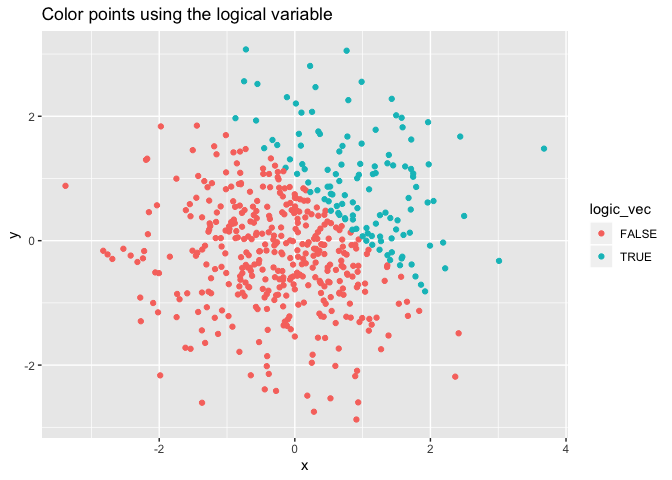
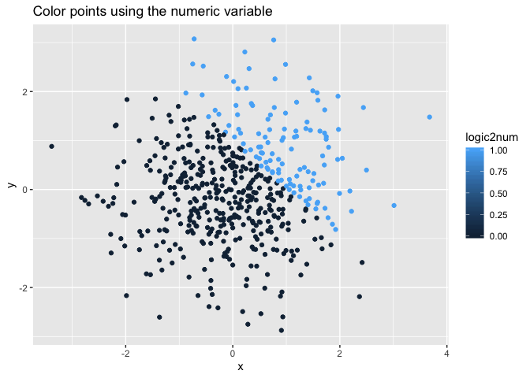
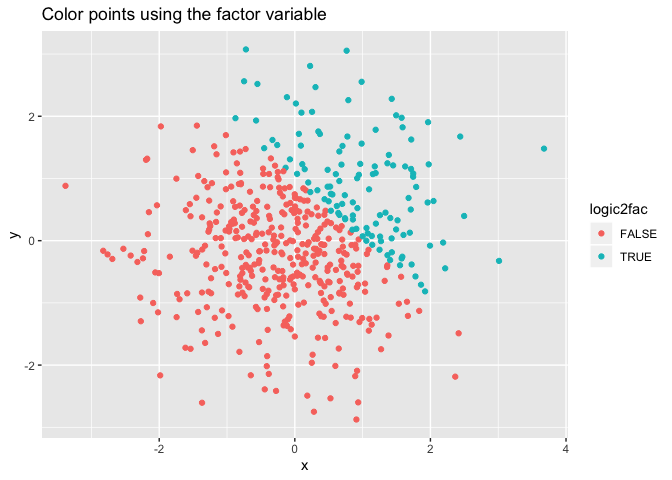

p8105\_hw1\_mz2777
================
Mengyu Zhang
9/14/2019

# Problem 1

Create the data frame.

``` r
#Create the data frame
df_p1 = tibble(
  norm_samp = rnorm(8, mean = 0, sd = 1),
  norm_samp_logical = norm_samp > 0,
  char_vec = c("A", "B", "C", "A", "B", "B", "C", "B"),
  fac_vec = factor(char_vec, labels = c("I","II","III"))
)
```

Character and factor variables did not work when the `mean` function was
applied to them. The messages are as
    follows.

    ## Warning in mean.default(pull(df_p1, char_vec)): argument is not numeric or
    ## logical: returning NA

    ## Warning in mean.default(pull(df_p1, fac_vec)): argument is not numeric or
    ## logical: returning NA

After applying the `as.numeric` function to the logical, character and
factor variables, logical and factor variables are able to be converted
to numeric variable. Since unlike character variables, these two kind of
variables can be represented by the numbers without losing their logic
and meanings. Therefore, this conversion can help explain why the mean
value of the character variables can not be calculated.

``` r
as.numeric(pull(df_p1, norm_samp_logical))
as.numeric(pull(df_p1, char_vec))
as.numeric(pull(df_p1, fac_vec))
```

Here are some conversions of
    variables.

``` r
as.numeric(pull(df_p1, norm_samp_logical)) * pull(df_p1, norm_samp)
```

    ## [1] 0.9471393 0.0000000 0.0000000 0.0000000 0.7854303 0.4368332 0.0000000
    ## [8] 0.0000000

``` r
factor(pull(df_p1, norm_samp_logical)) * pull(df_p1, norm_samp)
```

    ## Warning in Ops.factor(factor(pull(df_p1, norm_samp_logical)), pull(df_p1, :
    ## '*' not meaningful for factors

    ## [1] NA NA NA NA NA NA NA NA

``` r
as.numeric(factor(pull(df_p1, norm_samp_logical))) * pull(df_p1, norm_samp)
```

    ## [1]  1.8942787 -1.9396934 -1.4510939 -1.0923694  1.5708607  0.8736664
    ## [7] -0.2489409 -1.3059814

# Problem 2

``` r
df_p2 = tibble(
  x = rnorm(500, mean = 0, sd = 1),
  y = rnorm(500, mean = 0, sd = 1),
  logic_vec = x + y > 1,
  logic2num = as.numeric(logic_vec),
  logic2fac = factor(logic_vec)
)
```

A short description of the data frame I have built.

  - The size of the dataset is 500\*5.
  - The mean of x is -0.0721428.
  - The median of x is -0.0854917.
  - The standard deviation of x is 1.0381314.
  - The proportion of cases for which x + y \> 1 is 20.4%.

Make a scatterplot of y vs x; color points using the logical variable.
Make a second and third scatterplot that color points using the numeric
and factor variables, respectively, and **comment on the color
scales**.

``` r
pic1 = ggplot(df_p2, aes(x = x, y = y, color = logic_vec)) + geom_point()
pic2 = ggplot(df_p2, aes(x = x, y = y, color = logic2num)) + geom_point()
pic3 = ggplot(df_p2, aes(x = x, y = y, color = logic2fac)) + geom_point()
pic1
```

<!-- -->

``` r
pic2
```

<!-- -->

``` r
pic3
```

<!-- -->

``` r
ggsave("scatter point.png", plot = pic1)
```

    ## Saving 7 x 5 in image
